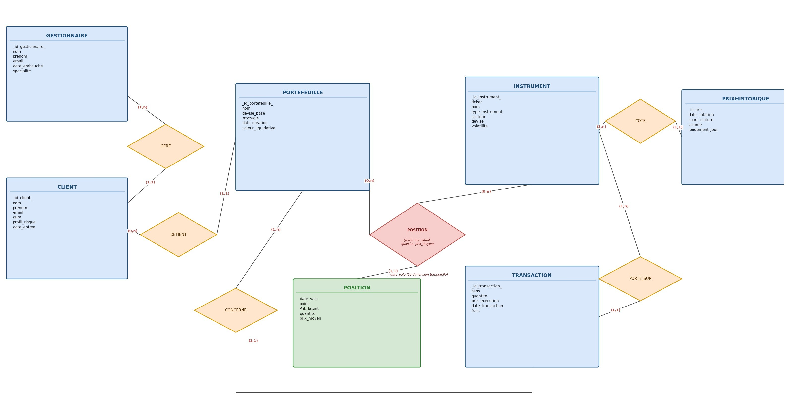

# [QuFiSQL] MySQL Console Application - Quant Finance

> **English Version :** [README.en.md](README.en.md)

Application Python en ligne de commande pour gérer les **clients** d'une société de gestion de patrimoine. Elle se connecte à une base MySQL et propose un menu interactif (CRUD, recherche, statistiques, détail avec données associées).

---

## Table des matières

- [Documentation](#documentation)
  - [Rapport de projet (PDF)](#rapport-bdd) — livrable principal *(modélisation, requêtes, application)
  - [Modèle conceptuel de données (MCD)](#modèle-conceptuel-de-données-mcd)
- [Instructions de lancement](#instructions-de-lancement)
  - [Prérequis](#prérequis)
  - [Compatibilité multi-OS](#compatibilité-multi-os)
  - [Étape 0 — Vue d'ensemble](#étape-0--vue-densemble-ordre-obligatoire)
  - [Étape 1 — Installer et configurer MySQL](#étape-1--installer-et-configurer-mysql)
  - [Étape 2 — Créer la base de données](#étape-2--créer-la-base-de-données-scripts-sql)
  - [Étape 3 — Configurer le fichier `.env`](#étape-3--configurer-les-accès-mysql-fichier-env)
  - [Étape 4 — Installer les dépendances Python](#étape-4--installer-les-dépendances-python)
  - [Étape 5 — Lancer l'application](#étape-5--lancer-lapplication)
  - [Dépannage](#dépannage-problèmes-courants)
- [Domaine choisi](#domaine-choisi)
- [Règles métiers](#règles-métiers)
- [Dictionnaire des données](#dictionnaire-des-données)
  - [Gestionnaire](#gestionnaire)
  - [Client](#client-entité-principale-de-lapplication)
  - [Portefeuille](#portefeuille)
  - [Instrument](#instrument-résumé)
  - [Position](#position-résumé)
  - [PrixHistorique](#prixhistorique-résumé)
  - [Transaction](#transaction-résumé)
- [Guide de réutilisation](#guide-de-réutilisation)
  - [Structure du projet](#structure-du-projet)
  - [Changer les identifiants MySQL](#changer-les-identifiants-mysql)
  - [Ajouter une fonctionnalité au menu](#ajouter-une-nouvelle-fonctionnalité-au-menu)
  - [Commandes de développement](#commandes-de-développement)
  - [Sécurité](#sécurité--que-cacher-)
- [Fonctionnalités du menu](#fonctionnalités-du-menu)
- [Version anglaise](#version-anglaise)

---

## Documentation

### Rapport BDD

**Livrable principal du projet** — à consulter pour l'évaluation.

**[Ouvrir le rapport (PDF) → docs/Rapport_BDD.pdf](docs/Rapport_BDD.pdf)**

| Contenu du rapport | |
|--------------------|---|
| Modélisation | MCD, MLD, dictionnaire des données, règles métiers |
| Requêtes SQL | 15 requêtes d'analyse (R1–R15) |
| Application | Description de l'interface console Python |
| Annexes | Code source, scripts SQL |

### Autres ressources

| Ressource | Description |
|-----------|-------------|
| [Rapport BDD (PDF)](docs/Rapport_BDD.pdf) | Rapport complet du projet (modélisation, requêtes, application) |
| MCD (ci-dessous) | Modèle conceptuel de données — 7 entités, relations et cardinalités |

### Modèle conceptuel de données (MCD)



Le schéma couvre la chaîne **Gestionnaire → Client → Portefeuille → Position / Transaction**, avec les instruments financiers et leur historique de cours.

---

## Instructions de lancement

Le projet comporte **deux parties distinctes** à configurer séparément :

| Partie | Rôle | Où l'exécuter |
|--------|------|---------------|
| **Base de données MySQL** | Créer les tables et insérer les données | MySQL Workbench ou terminal (`mysql`) |
| **Application Python** | Menu console (CRUD, recherche, stats) | Terminal ou IDE (Cursor, VS Code, PyCharm) |

> **Important :** les scripts SQL (`sql/*.sql`) ne s'exécutent **pas** dans l'IDE Python. L'application Python se contente de **se connecter** à une base déjà créée.

### Prérequis

| Outil | Version | Vérification |
|-------|---------|--------------|
| Python | 3.10+ | `python --version` ou `python3 --version` |
| Poetry | 2.x | `poetry --version` |
| MySQL Server | 8+ | Voir étape 1 ci-dessous |

### Compatibilité multi-OS

Compatible **Windows 10+**, **macOS 12+** (Intel et Apple Silicon) et **Linux**. L'application Python utilise `pathlib` et ne contient aucune dépendance spécifique à un système — le même code fonctionne sur tous les OS.

| Élément | Windows | macOS / Linux |
|---------|---------|---------------|
| Terminal | PowerShell ou CMD | Terminal (bash/zsh) |
| Copier `.env` | `Copy-Item .env.example .env` | `cp .env.example .env` |
| Interpréteur Poetry | `.venv/Scripts/python.exe` | `.venv/bin/python` |
| Scripts SQL (CLI) | Voir alternative PowerShell ci-dessous | `mysql -u root -p < sql/...` |

---

### Étape 0 — Vue d'ensemble (ordre obligatoire)

```
1. Installer et démarrer MySQL Server
2. Exécuter sql/script_creation.sql   → crée les tables (structure)
3. Exécuter sql/ScriptDML.sql         → insère les données de test
4. Copier .env.example → .env         → configurer le mot de passe MySQL
5. poetry install                       → installer les dépendances Python
6. poetry run python -m src             → lancer l'application
```

---

### Étape 1 — Installer et configurer MySQL

#### Windows

##### Option A — MySQL Installer (recommandé)

1. Télécharger [MySQL Installer](https://dev.mysql.com/downloads/installer/)
2. Choisir **MySQL Server** (+ optionnel : **MySQL Workbench** pour une interface graphique)
3. Lors de l'installation, définir un mot de passe pour l'utilisateur `root` (à retenir pour `.env`)
4. Laisser le port par défaut : **3306**
5. Vérifier que le service MySQL est démarré :
   - `Services` → chercher **MySQL80** (ou similaire) → statut **En cours d'exécution**
   - Ou en PowerShell : `Get-Service -Name "*mysql*"`

##### Option B — XAMPP (alternative simple)

1. Installer [XAMPP](https://www.apachefriends.org/)
2. Démarrer **MySQL** depuis le panneau de contrôle XAMPP
3. Par défaut : utilisateur `root`, mot de passe **vide** (`DB_PASSWORD=` dans `.env`)

#### macOS

##### Option A — Homebrew (recommandé)

1. Installer [Homebrew](https://brew.sh/) si nécessaire
2. Installer MySQL :
   ```bash
   brew install mysql
   ```
3. Démarrer le service :
   ```bash
   brew services start mysql
   ```
4. Sécuriser l'installation (définir le mot de passe `root`) :
   ```bash
   mysql_secure_installation
   ```
5. Vérifier que MySQL écoute sur le port **3306** :
   ```bash
   brew services list
   ```

##### Option B — Installeur DMG MySQL

1. Télécharger [MySQL Community Server](https://dev.mysql.com/downloads/mysql/) (macOS)
2. Suivre l'assistant d'installation et définir un mot de passe pour `root`
3. Démarrer MySQL :
   - **Préférences Système → MySQL → Start MySQL Server**, ou
   - En terminal : `mysql.server start`

#### Vérifier la connexion MySQL (tous OS)

**Via MySQL Workbench :**
- Ouvrir Workbench → connexion `Local instance MySQL` → entrer le mot de passe `root`

**Via terminal :**
```bash
mysql -u root -p
```
Si vous voyez le prompt `mysql>`, la connexion fonctionne. Tapez `EXIT;` pour quitter.

> Sous macOS avec Homebrew, si `mysql` n'est pas reconnu, ajouter au PATH :  
> `echo 'export PATH="/opt/homebrew/opt/mysql/bin:$PATH"' >> ~/.zshrc && source ~/.zshrc`  
> (Intel : remplacer `/opt/homebrew` par `/usr/local`)

---

### Étape 2 — Créer la base de données (scripts SQL)

Deux scripts, **dans cet ordre** :

| Script | Type | Action |
|--------|------|--------|
| `sql/script_creation.sql` | **DDL** | Crée la base `quant_finance` et les 7 tables (sans données) |
| `sql/ScriptDML.sql` | **DML** | Insère les données de démonstration (clients, gestionnaires, etc.) |

Le fichier `sql/requetes.sql` contient des requêtes **SELECT** d'analyse (R1–R15) — il ne crée ni tables ni données. À exécuter séparément pour tester des requêtes SQL.

#### Méthode 1 — MySQL Workbench (recommandé pour débutants, tous OS)

1. Ouvrir **MySQL Workbench** et se connecter
2. **File → Open SQL Script…** → sélectionner `sql/script_creation.sql`
3. Cliquer sur l'icône **Execute** (éclair) ou `Ctrl+Shift+Enter` (macOS : `Cmd+Shift+Enter`)
4. Vérifier le message de succès dans l'onglet **Action Output**
5. Répéter avec `sql/ScriptDML.sql`

#### Méthode 2 — Ligne de commande

Depuis la racine du projet (`QuFiSQL/`) :

**macOS / Linux (bash ou zsh) :**
```bash
mysql -u root -p < sql/script_creation.sql
mysql -u root -p < sql/ScriptDML.sql
```

**Windows (PowerShell)** — si la redirection `<` ne fonctionne pas :
```powershell
Get-Content sql/script_creation.sql | mysql -u root -p
Get-Content sql/ScriptDML.sql | mysql -u root -p
```

**Windows (CMD ou Git Bash)** — la syntaxe bash fonctionne aussi :
```bash
mysql -u root -p < sql/script_creation.sql
mysql -u root -p < sql/ScriptDML.sql
```

#### Vérifier que les données sont bien insérées

```sql
USE quant_finance;
SELECT COUNT(*) FROM Client;       -- doit retourner 8
SELECT COUNT(*) FROM Gestionnaire; -- doit retourner 6
```

---

### Étape 3 — Configurer les accès MySQL (fichier `.env`)

Copier le template et renseigner **votre** mot de passe MySQL :

**macOS / Linux :**
```bash
cp .env.example .env
```

**Windows (PowerShell) :**
```powershell
Copy-Item .env.example .env
```

Éditer `.env` :

```env
DB_HOST=localhost
DB_USER=root
DB_PASSWORD=votre_mot_de_passe    # celui défini à l'installation MySQL
DB_NAME=quant_finance
```

> **Important :** le fichier `.env` n'est **jamais** versionné (secrets). Seul `.env.example` est commité.

---

### Étape 4 — Installer les dépendances Python

Depuis la racine du projet :

```bash
poetry config virtualenvs.in-project true
poetry install
```

Cela crée un environnement virtuel `.venv/` et installe :
- `mysql-connector-python` — connexion MySQL
- `python-dotenv` — lecture du fichier `.env`

---

### Étape 5 — Lancer l'application

**Terminal (recommandé) — macOS, Linux et Windows :**
```bash
poetry run python -m src
```

**Alternative (shim à la racine) :**
```bash
poetry run python main.py
```

**Dans un IDE (Cursor / VS Code / PyCharm) :**
1. Ouvrir le dossier `QuFiSQL/` comme projet
2. Sélectionner l'interpréteur Python selon votre OS :

| OS | Chemin de l'interpréteur |
|----|--------------------------|
| Windows | `.venv/Scripts/python.exe` |
| macOS / Linux | `.venv/bin/python` |

3. Lancer `main.py` ou exécuter le module `src` (`python -m src`)

> Sous macOS, ouvrir le **Terminal** intégré (Cursor/VS Code : `` Ctrl+` ``) ou l'application Terminal, se placer dans le dossier `QuFiSQL/`, puis lancer les commandes Poetry ci-dessus.

Si la connexion réussit, vous verrez :
```
Quant Finance Console Application
Connecting to MySQL...
Connected successfully.
```
Puis le menu interactif s'affiche.

---

### Dépannage (problèmes courants)

| Erreur | Cause probable | Windows | macOS |
|--------|----------------|---------|-------|
| `Can't connect to MySQL server on 'localhost'` | MySQL non démarré | Services → MySQL80, ou XAMPP | `brew services start mysql` ou `mysql.server start` |
| `Access denied for user 'root'@'localhost'` | Mot de passe incorrect | Vérifier `DB_PASSWORD` dans `.env` | Idem |
| `Unknown database 'quant_finance'` | Scripts SQL non exécutés | Relancer `script_creation.sql` puis `ScriptDML.sql` | Idem |
| `Table 'quant_finance.Client' doesn't exist` | DDL non exécuté | Exécuter `script_creation.sql` | Idem |
| `poetry: command not found` | Poetry non installé | `pip install poetry` | `pip install poetry` ou `brew install poetry` |
| `mysql: command not found` | Client MySQL absent du PATH | Réinstaller MySQL ou ajouter au PATH | `brew install mysql` puis configurer le PATH (voir étape 1) |
| Menu vide / aucun client | DML non exécuté | Exécuter `ScriptDML.sql` | Idem |

**Réinitialiser complètement la base (macOS / Linux / Git Bash) :**
```bash
mysql -u root -p -e "DROP DATABASE IF EXISTS quant_finance;"
mysql -u root -p < sql/script_creation.sql
mysql -u root -p < sql/ScriptDML.sql
```

**Réinitialiser sous PowerShell (Windows) :**
```powershell
mysql -u root -p -e "DROP DATABASE IF EXISTS quant_finance;"
Get-Content sql/script_creation.sql | mysql -u root -p
Get-Content sql/ScriptDML.sql | mysql -u root -p
```

---

## Domaine choisi

**Gestion de patrimoine / Finance quantitative**

| Élément | Description |
|---------|-------------|
| Secteur | Gestion d'actifs pour clients privés et institutionnels |
| Entité principale (CRUD) | **Client** — investisseur suivi par un gestionnaire |
| Données associées (lecture) | **Gestionnaire** (manager), **Portefeuille** (portfolios) |
| Schéma complet | 7 tables : Gestionnaire, Client, Portefeuille, Instrument, Position, PrixHistorique, Transaction |

L'application console se concentre sur la table `Client`, tout en affichant les relations avec le gestionnaire assigné et les portefeuilles du client (option 8 du menu).

---

## Règles métiers

| Code | Règle métier |
|------|--------------|
| **RM01** | Un client est suivi par exactement un gestionnaire à un instant donné ; un gestionnaire suit 0 à N clients. |
| **RM02** | Un client détient au moins un portefeuille ; chaque portefeuille appartient à un seul client. |
| **RM03** | Le profil de risque d'un client appartient à : *prudent*, *équilibré*, *dynamique*, *agressif*. |
| **RM04** | L'*AUM* d'un client est positif ; un profil agressif exige un AUM ≥ 100 000 € (cohérence réglementaire). |
| **RM05** | Une position relie un portefeuille, un instrument et une date de valorisation (association ternaire). |
| **RM06** | Le poids d'une position est compris entre 0 et 1 (0 % à 100 %). |
| **RM07** | La somme des poids des positions d'un même portefeuille à une date donnée ne dépasse pas 1 (100 %). |
| **RM08** | La quantité d'une position est strictement positive ; le prix moyen est strictement positif. |
| **RM09** | Le *PnL latent* d'une position peut être positif ou négatif (gain ou perte non réalisé). |
| **RM10** | Un instrument a un ticker unique et un type parmi : *action*, *obligation*, *ETF*, *dérivé*. |
| **RM11** | La volatilité d'un instrument est positive ou nulle (exprimée en pourcentage annualisé). |
| **RM12** | Une transaction a un sens parmi : *ACHAT* ou *VENTE* ; sa quantité et son prix d'exécution sont strictement positifs. |
| **RM13** | Les frais d'une transaction sont positifs ou nuls et n'excèdent pas 5 % du montant brut. |
| **RM14** | Une transaction concerne un seul portefeuille et porte sur un seul instrument. |
| **RM15** | Pour un instrument donné, il existe au plus un prix historique par date de cotation (unicité ticker + date). |
| **RM16** | Le cours de clôture d'un prix historique est strictement positif ; le volume est positif ou nul. |
| **RM17** | La devise d'un portefeuille et d'un instrument suit le format ISO 4217 (3 lettres majuscules, ex. `EUR`, `USD`). |
| **RM18** | La date de valorisation d'une position ne peut pas être antérieure à la date de création du portefeuille. |

Certaines règles sont enforced directement dans le schéma MySQL (`sql/script_creation.sql`) via contraintes `CHECK`, clés étrangères et unicité ; d'autres (RM02, RM07, RM18) relèvent de la logique métier et doivent être respectées lors de l'insertion des données.

---

## Dictionnaire des données

### Gestionnaire

| Colonne | Type | Description |
|---------|------|-------------|
| `id_gestionnaire` | INT, PK, AUTO | Identifiant unique |
| `nom` | VARCHAR(100) | Nom de famille |
| `prenom` | VARCHAR(100) | Prénom |
| `email` | VARCHAR(150), UNIQUE | Email professionnel |
| `date_embauche` | DATE | Date d'embauche |
| `specialite` | VARCHAR(100), NULL | Domaine d'expertise (ex. actions tech) |

### Client *(entité principale de l'application)*

| Colonne | Type | Description |
|---------|------|-------------|
| `id_client` | INT, PK, AUTO | Identifiant unique |
| `nom` | VARCHAR(100) | Nom de famille |
| `prenom` | VARCHAR(100) | Prénom |
| `email` | VARCHAR(150), UNIQUE | Email du client |
| `aum` | DECIMAL(18,2) | Assets Under Management — actifs totaux gérés |
| `profil_risque` | ENUM | Tolérance au risque (voir RM03) |
| `date_entree` | DATE | Date d'entrée en relation |
| `id_gestionnaire` | INT, FK | Gestionnaire assigné |

### Portefeuille

| Colonne | Type | Description |
|---------|------|-------------|
| `id_portefeuille` | INT, PK, AUTO | Identifiant unique |
| `nom` | VARCHAR(150) | Nom du portefeuille |
| `devise_base` | CHAR(3) | Devise de référence (ISO) |
| `strategie` | VARCHAR(100), NULL | Stratégie d'investissement |
| `date_creation` | DATE | Date de création |
| `valeur_liquidative` | DECIMAL(18,2) | NAV — valeur nette du portefeuille |
| `id_client` | INT, FK | Client propriétaire |

### Instrument *(résumé)*

| Colonne | Type | Description |
|---------|------|-------------|
| `id_instrument` | INT, PK | Identifiant |
| `ticker` | VARCHAR(20), UNIQUE | Symbole boursier |
| `nom` | VARCHAR(150) | Nom complet |
| `type_instrument` | ENUM | action / obligation / ETF / dérivé |
| `secteur` | VARCHAR(100) | Secteur d'activité |
| `devise` | CHAR(3) | Devise de cotation |
| `volatilite` | DECIMAL(10,4) | Volatilité annualisée |

### Position *(résumé)*

| Colonne | Type | Description |
|---------|------|-------------|
| `id_portefeuille` | INT, PK/FK | Portefeuille |
| `id_instrument` | INT, PK/FK | Instrument détenu |
| `date_valo` | DATE, PK | Date de valorisation |
| `quantite` | DECIMAL(18,6) | Nombre de titres |
| `prix_moyen` | DECIMAL(18,4) | Prix moyen d'achat |
| `poids` | DECIMAL(5,4) | Poids dans le portefeuille (0–1) |
| `pnl_latent` | DECIMAL(18,2) | Profit/perte latent |

### PrixHistorique *(résumé)*

| Colonne | Type | Description |
|---------|------|-------------|
| `id_prix` | INT, PK | Identifiant |
| `date_cotation` | DATE | Date du cours |
| `cours_cloture` | DECIMAL(18,4) | Prix de clôture |
| `volume` | BIGINT | Volume échangé |
| `rendement_jour` | DECIMAL(10,6) | Rendement journalier |
| `id_instrument` | INT, FK | Instrument concerné |

### Transaction *(résumé)*

| Colonne | Type | Description |
|---------|------|-------------|
| `id_transaction` | INT, PK | Identifiant |
| `sens` | ENUM | ACHAT / VENTE |
| `quantite` | DECIMAL(18,6) | Quantité |
| `prix_execution` | DECIMAL(18,4) | Prix d'exécution |
| `date_transaction` | DATE | Date de l'opération |
| `frais` | DECIMAL(18,2) | Frais de transaction |
| `id_portefeuille` | INT, FK | Portefeuille |
| `id_instrument` | INT, FK | Instrument |

---

## Guide de réutilisation

### Structure du projet

```
QuFiSQL/
├── README.md               # Documentation complète (français)
├── README.en.md            # Documentation (English)
├── pyproject.toml          # Dépendances Poetry
├── poetry.lock
├── .env.example            # Template de configuration (sans secrets)
├── .env                    # Config locale (gitignored)
├── main.py                 # Shim → délègue à src/
├── docs/                   # Documentation et livrables
│   ├── Rapport_BDD.pdf     # Rapport complet du projet
│   └── MCD_Quant_Finance.jpg  # Modèle conceptuel de données
├── sql/                    # Scripts SQL
│   ├── script_creation.sql # DDL (schéma)
│   ├── ScriptDML.sql       # Données de test
│   └── requetes.sql        # Requêtes analytiques R1–R15
└── src/                    # Code source (application Python)
    ├── __main__.py         # Point d'entrée
    └── app/
        ├── config.py       # Constantes + chargement .env
        ├── db.py           # Connexion MySQL
        ├── repositories/
        │   └── client_repository.py  # Requêtes SQL
        └── ui/
            ├── menu.py     # Boucle du menu principal
            ├── handlers.py # Logique de chaque option
            ├── prompts.py  # Saisies utilisateur
            └── formatters.py  # Affichage console
```

### Changer les identifiants MySQL

Éditer `.env` — aucune modification de code nécessaire.

### Ajouter une nouvelle fonctionnalité au menu

1. **Repository** — ajouter la requête SQL dans `src/app/repositories/client_repository.py`
2. **Handler** — créer `handle_xxx()` dans `src/app/ui/handlers.py`
3. **Menu** — enregistrer l'action dans `src/app/ui/menu.py` (`actions` dict + `print_main_menu`)

### Commandes de développement

```bash
# Vérifier le style et les erreurs
poetry run ruff check .

# Formater automatiquement
poetry run ruff format .

# Corriger les imports et erreurs simples
poetry run ruff check . --fix
```

### Sécurité — que cacher ?

| Fichier | Versionner ? | Contenu |
|---------|-------------|---------|
| `.env.example` | Oui | Template sans mot de passe réel |
| `.env` | **Non** | Mot de passe MySQL, credentials |
| `src/app/config.py` | Oui | Lit les variables d'environnement, pas de secrets en dur |

---

## Fonctionnalités du menu

| # | Action |
|---|--------|
| 1 | Ajouter un client |
| 2 | Lister tous les clients |
| 3 | Rechercher par critère (profil, gestionnaire, plage AUM) |
| 4 | Modifier un client |
| 5 | Supprimer un client |
| 6 | Statistiques et classements |
| 7 | Recherche par mot-clé |
| 8 | Détail client + gestionnaire + portefeuilles |
| 9 | Lister les gestionnaires disponibles |
| 0 | Quitter |

---

## Version anglaise

Documentation condensée en anglais : **[README.en.md](README.en.md)**
